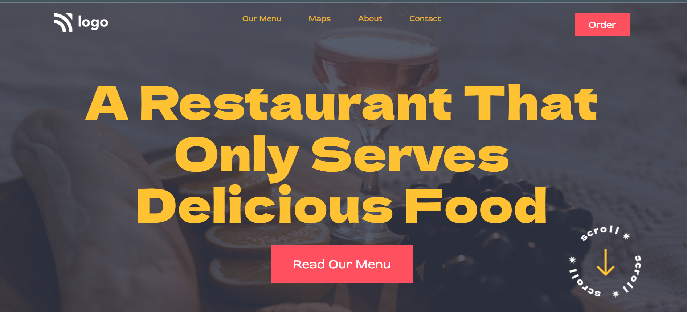

# **Food Restaurant Home Page | Project_02**

Hello, I'm **Vikash Yadav** 

This project is a part of the **Full Stack Javascript** course by ineuron.ai. It is given by our instructor and mentor, **Hitesh** sir,  as an assignment.

### **What I have learned ?**

In this, I have learned about **CSS position, background-image, and linear-gredient**, how to set overlay on background image.

### **Time spent to finish it.**

It took me 3 hours to complete this project.

**[Live Project's netlify link](https://food-restaurant-project-02.netlify.app/ "Project link")**

